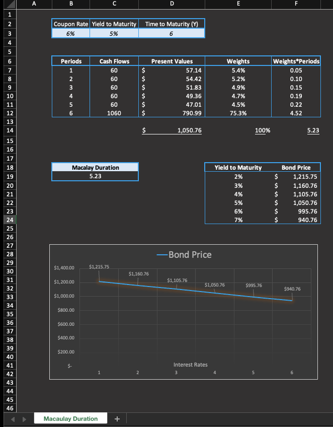

# Macaulay_duration_bond_convexity

## Description
This project analyzes bond duration and convexity, calculating key metrics like Macaulay Duration, present values, weights, and bond price variations at different yields to support understanding of bond sensitivity to changes.

## Files
- `macaulay_duration_bond_convexity.xlsx`: Excel file with bond duration and convexity calculations, including Macaulay Duration, present values, weights, and bond price variations at different yields.
- `output.png`: Plot

## Screenshots

